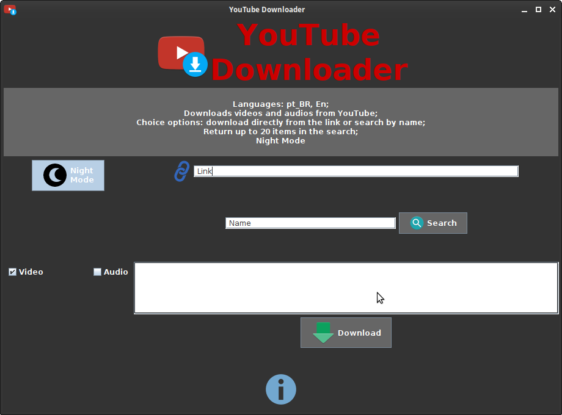
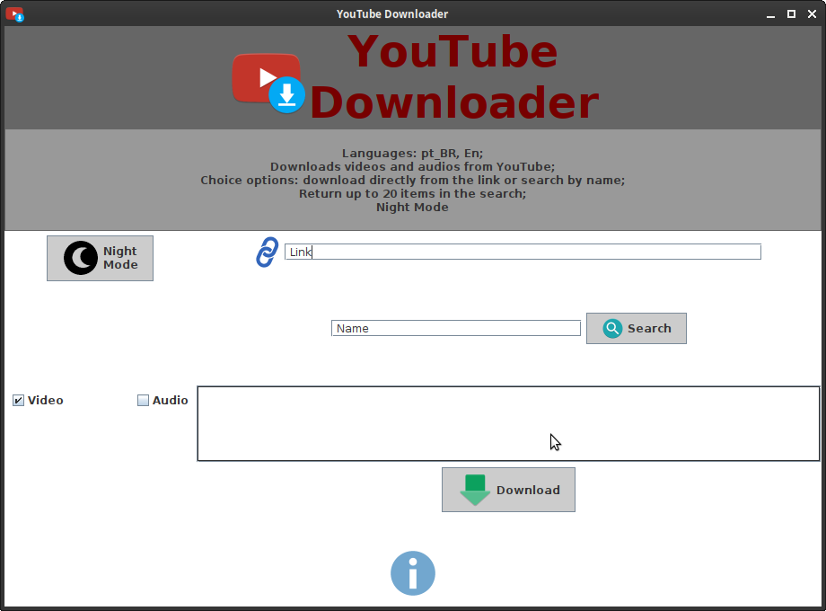

# YouTube Downloader
Download videos and audios from YouTube.

# Screenshots
## Night Mode

## Default

# Requirements
* wget (optional to download the .deb package)
* default-jre
* python3
* python3-pip
* ffmpeg
* youtube-search (pip3 package)
* youtube-dl (pip3 package)

# Recommended
* VLC Player

# Install
## via apt
1. `wget https://github.com/fabioskb/youtube_downloader/releases/download/Latest/youtube-downloader_2.0.2_amd64.deb` 
2. `$ sudo apt install ./youtube-downloader_amd64_2.0.2.deb` 
1. `$ ydl` (or simply open it in the network applications category)
## via dpkg 
1. `wget https://github.com/fabioskb/youtube_downloader/releases/download/Latest/youtube-downloader_2.0.2_amd64.deb` 
2. `$ sudo dpkg -i ./youtube-downloader_amd64_2.0.2.deb` 
3. `$ sudo apt install -f`
4. `$ ydl` (or simply open it in the network applications category)

**A stable internet connection is required.**

# Credits
* [youtube-search](https://pypi.org/project/youtube-search/ "Python function for searching for youtube videos to avoid using their heavily rate-limited API")
* [youtube-dl](https://pypi.org/project/youtube_dl/ "Command-line program to download videos from YouTube.com and other video sites")
* [Python](https://www.python.org/ "Python site")
* [Java](https://www.java.com "Java site")

# Downloads
* <a href="https://github.com/fabioskb/youtube_downloader/releases/Latest">Latest</a>
* <a href="https://github.com/fabioskb/changes/blob/main/youdl.md">Changelogs</a>
