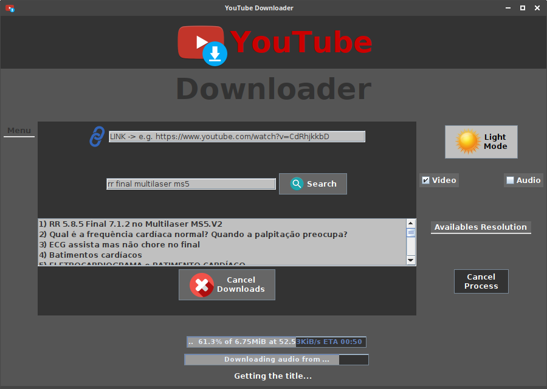
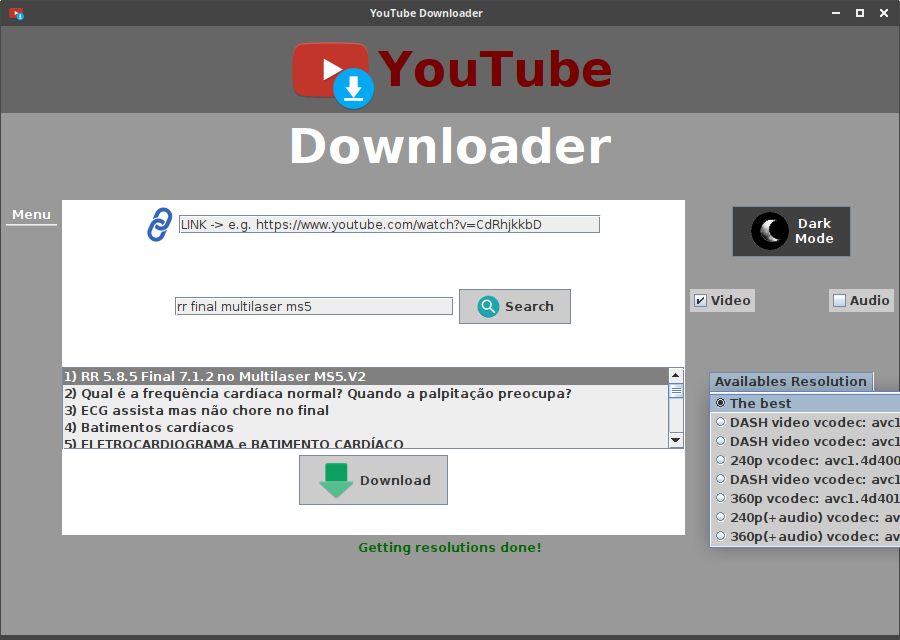

# YouTube Downloader

## Download videos and audios from YouTube

* **You can download directly through the link or search by name.**
* **You can choose the video resolution.**
* **The search returns 20 options that can be downloaded.**
* **Download up to three files simultaneously**
* **Support only for Linux amd64 (for now).**
* **Option for dark/light mode.**
* **Cancel currently running process**
* **Option to run background downloads when exiting the app.**
* **Automatically activated dark mode if the time is between 17:00 and 5:00 hours.**
* **Choose between audio or video to download**
* **Description of each item in the list via ToolTip when selecting with the mouse (channel, duration, views and publish_time).**
* **Download progress bars**
* **Install all dependencies on the first boot of the application.**

## Screenshots

### Dark Mode

### Light Mode

## Requirements

* wget (optional to download the .deb package)
* default-jre (jre-11+ recommended)
* python3
* python3-pip
* ffmpeg
* youtube-search (pip3 package)
* youtube-dl (pip3 package)

## Recommended

* VLC Player

## Install

### via apt

1. `wget https://github.com/fabioskb/youtube_downloader/releases/download/v2.5.0/youtube-downloader_2.5.0_amd64.deb`
2. `sudo apt install ./youtube-downloader_amd64_2.5.0.deb`
3. `ydl` (or simply open it in the network applications category)

### via dpkg

1. `wget https://github.com/fabioskb/youtube_downloader/releases/download/v2.5.0/youtube-downloader_2.5.0_amd64.deb`
2. `sudo dpkg -i ./youtube-downloader_amd64_2.5.0.deb`
3. `sudo apt install -f`
4. `ydl` (or simply open it in the network applications category)

**A stable internet connection is required.**

## Credits

* [youtube-search](https://pypi.org/project/youtube-search/ "Python function for searching for youtube videos to avoid using their heavily rate-limited API")
* [youtube-dl](https://pypi.org/project/youtube_dl/ "Command-line program to download videos from YouTube.com and other video sites")
* [Python](https://www.python.org/ "Python site")
* [Java](https://www.java.com "Java site")

## Downloads

* [Latest](https://github.com/fabioskb/youtube_downloader/releases/tag/v2.5.0)
* [Changelog](https://github.com/fabioskb/changes/blob/main/youdl.md)
